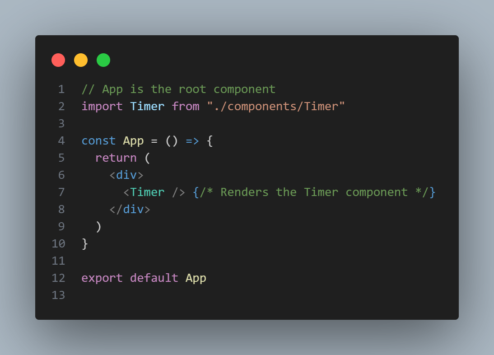
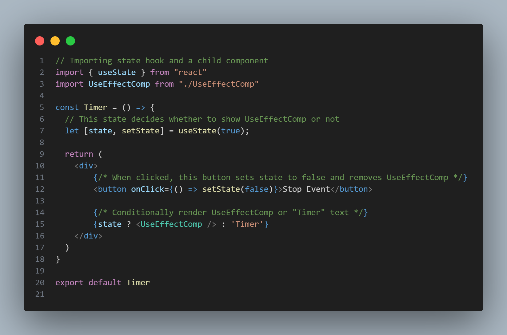

# 🧠 React App with useEffect Cleanup

This project demonstrates how to use the `useEffect` hook in React, including how to properly clean up side effects like event listeners when a component unmounts.

---

## 📁 File Structure

src/ │ ├── App.jsx ├── components/ │ ├── Timer.jsx │ └── UseEffectComp.jsx

---

## 🧩 App.jsx

# 🔍 What it does:
This is the entry point of the app.

It renders the Timer component inside a .

# ⏱️ Timer.jsx :
 

# 🔍 What it does:
It shows a button that toggles the visibility of UseEffectComp.

When Stop Event is clicked:

state becomes false,

UseEffectComp is removed from the screen (unmounted).

When the component unmounts, it triggers cleanup (handled inside UseEffectComp)

# 🧠 UseEffectComp.jsx : 

## 🔍 What it does:
Tracks the current window width using useState.

Adds a resize event listener on the browser window when the component mounts.

On every resize, it updates the state with the new width.

🧹 Cleanup Function:
When the component unmounts, the return inside useEffect removes the event listener to avoid memory leaks.

## 🧼 Why Cleanup is Important
Without cleanup, the event listener would remain active even after the component is removed, which could:

Cause memory leaks,

Lead to unexpected errors,

Make the app slower over time.
