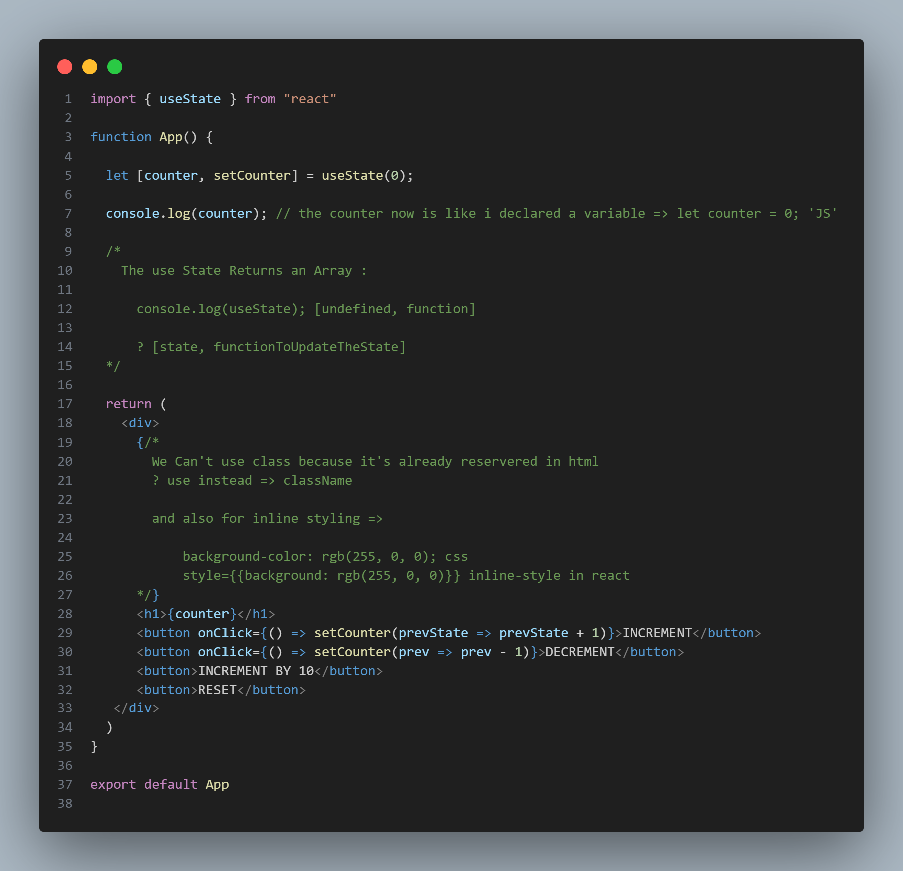
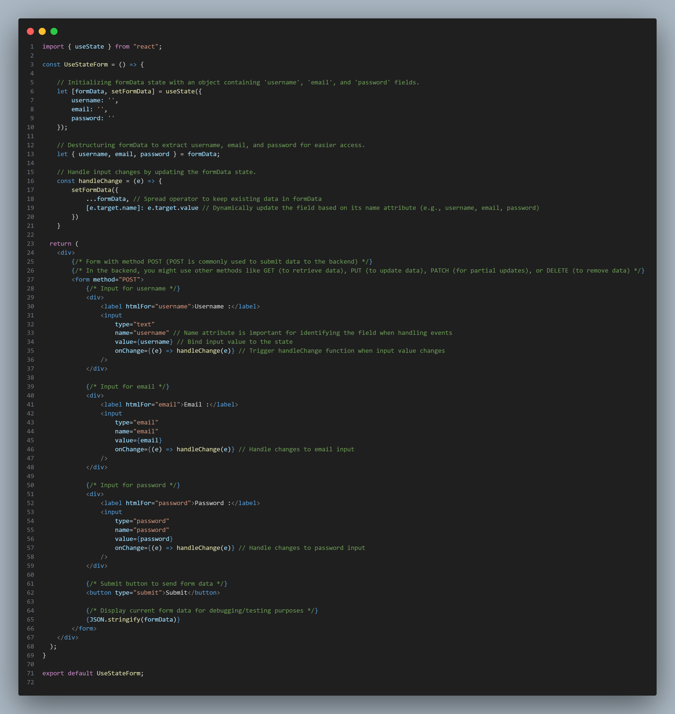

# Package JSON

    the package.json file is metadata file that contains important information about the project,
    such as its name, version, dependencies, scripts...

## Why We Use Npm init ? 

    When starting a new project, you run `npm init` 
    for a default setup. by using it You're ensuring that your project
    has a clean configuration. it also helps manage dependencies and scripts for
    your project. 

    ```bash 
            npm init 
    ```

## Why It's Important : 

    ### - Keeps Track of Dependencies.
    ### - Organizes Scripts.
    ### - Helpts with versioning

# React Hooks!

#### Welcome To React Hooks.

## Use State : 


# Form with State Management

This form component uses React's `useState` hook to manage the state of user inputs such as username, email, and password. The `handleChange` function is used to dynamically update the state when the user types in any of the fields.

### Screenshot of the Code:



### Key Features:
- **State Management**: The form inputs are controlled using React's `useState` hook, which ensures the input fields' values are always in sync with the component's state.

- **Dynamic State Updates**: The `handleChange` function dynamically updates the state for each form field based on the field's `name` attribute.

- **Backend HTTP Methods**: The form uses the `POST` method for sending data to the backend. Other HTTP methods like `GET`, `PUT`, `PATCH`, and `DELETE` are mentioned for clarity on how data is handled in the backend.

### Example Usage:
This component is typically used in registration or login forms where the user needs to input credentials, which are sent to the backend upon submission.


