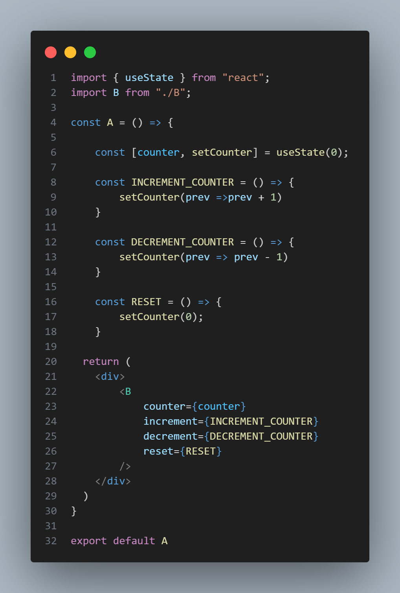
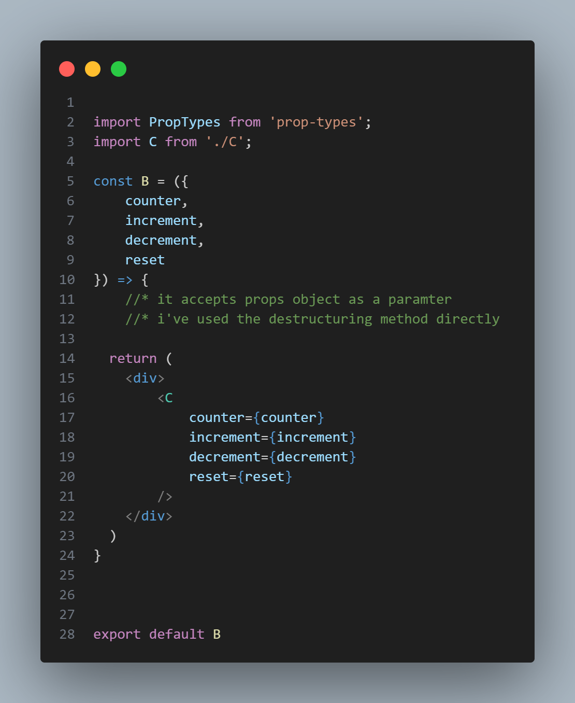
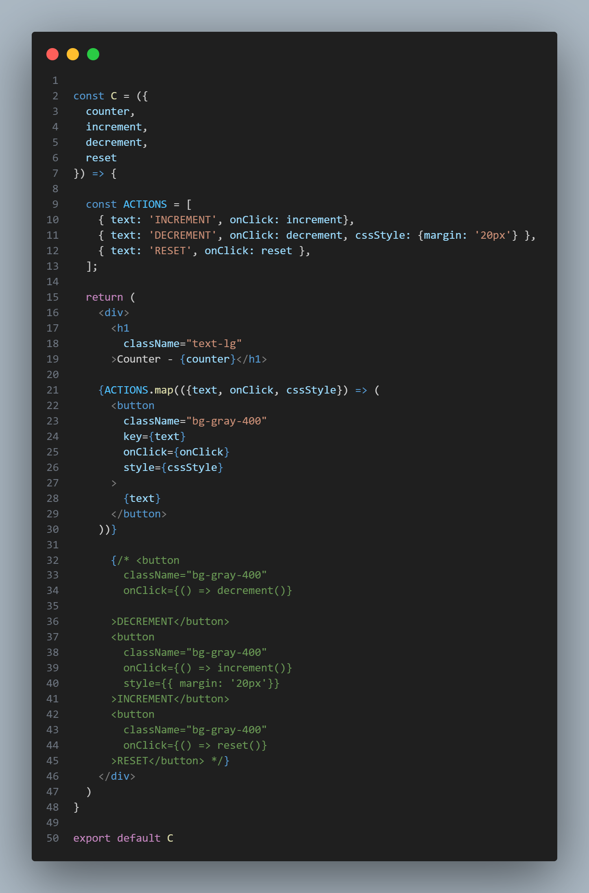

# 📦 React Props Example with Dynamic Button Rendering

This project demonstrates how **props** and dynamic rendering work in React by passing state and functions through multiple components (A → B → C) and rendering buttons using a mapped array.

---

## 📁 File Structure

src/ │ ├── A.jsx ├── components/ │ ├── B.jsx │ └── C.jsx

## 🔍 What it does:
Manages the main counter state and its update functions.

Passes the data and logic as props to B.

## 🔍 What it does:
Receives props from A using destructuring.

Forwards those props to C.

## 🔍 What it does:
Displays the current counter value.

Renders action buttons dynamically using an array called ACTIONS.

Each button executes its corresponding function (increment, decrement, reset) when clicked.

# 🧠 Why This Is Cool
✅ Dynamic Rendering: Buttons are not hard-coded; they are generated from a data array.

🧼 Cleaner Code: Using map() reduces repetitive JSX and makes future changes easier.

🔁 Prop Drilling: Props flow from A → B → C to control behavior across components.

