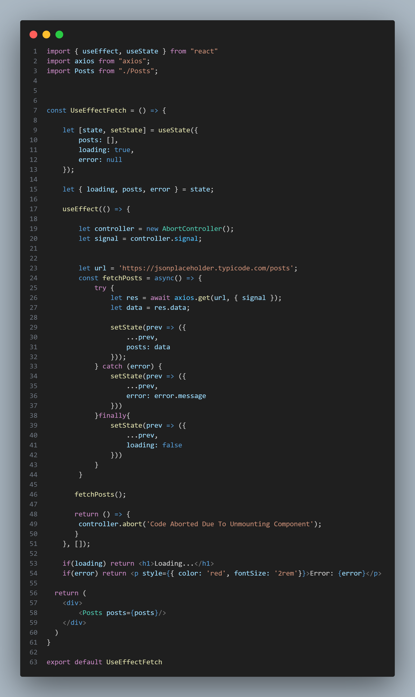

## Axios : 

Axios is a library that helps you make HTTP requests (like fetching or sending data) in JavaScript. It makes it easier to communicate with APIs (servers) from your web applications.

### Axios Installation : 
```bash 
npm install axios
```

# 🧠 React App with useEffect Fetch and AbortController

This project demonstrates how to use the useEffect hook in React for fetching data and cleaning up asynchronous operations when a component unmounts. It includes handling the AbortController to cancel fetch requests when necessary.

# 📁 File Structure : 
src/
 ├── App.jsx
 ├── components/
 │   ├── UseEffectFetch.jsx
 │   └── Posts.jsx

# 🧩 UseEffectFetch.jsx
This component is responsible for fetching posts from an API and displaying them using the Posts component. It uses the useEffect hook to manage the fetch request lifecycle and the AbortController to cancel the fetch if the component unmounts.

## 🔍 What it does:
Fetches a list of posts from the API (https://jsonplaceholder.typicode.com/posts) when the component mounts.

Uses AbortController to cancel the request if the component unmounts before the fetch completes, preventing memory leaks or errors.

Updates the state with the fetched data or handles any errors.

Renders loading, error, or fetched posts based on the current state.

## 📌 Code Breakdown: 


## 🧹 Cleanup Function:
The cleanup function inside useEffect (return () => { controller.abort() }) ensures that if the component is unmounted before the fetch request is completed, it cancels the request to prevent potential memory leaks.

You can pass a reason to abort() for better debugging, like 'Code Aborted Due To Unmounting Component'.

# 🧩 Posts.jsx
This component is responsible for rendering the list of posts fetched by the UseEffectFetch component.

## 🔍 What it does:
Receives posts as a prop from UseEffectFetch.

Renders a list of post titles (up to 10 posts).

## 📌 Code Breakdown:
